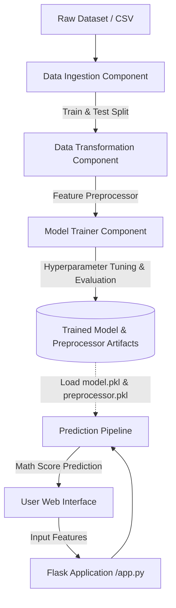

# 🎓 Student Performance Prediction - End-to-End Machine Learning Project

[](https://www.python.org/)
[](https://flask.palletsprojects.com/)
[](https://scikit-learn.org/)
[](LICENSE)

An end-to-end production-grade Machine Learning application that predicts a student's math performance score based on demographic attributes, parental education background, test preparation status, and scores in reading and writing.

---

## 📌 Table of Contents
- [Project Overview](#-project-overview)
- [Key Features](#-key-features)
- [Project Architecture](#-project-architecture)
- [Directory Structure](#-directory-structure)
- [Machine Learning Pipeline](#-machine-learning-pipeline)
- [Tech Stack](#-tech-stack)
- [Getting Started](#-getting-started)
  - [Prerequisites](#prerequisites)
  - [Installation](#installation)
  - [Running the Application](#running-the-application)
- [Web Interface Usage](#-web-interface-usage)
- [Author](#-author)

---

## 📖 Project Overview

Understanding the factors influencing student performance is critical for educational institutions to design targeted interventions. This project implements a complete, modular, and reproducible machine learning lifecycle:

1. **Exploratory Data Analysis (EDA):** Deep analysis of factors influencing student academic outcomes.
2. **Modular Data Pipelines:** Clean pipelines for ingestion, preprocessing, imputation, and encoding.
3. **Multi-Model Training & Tuning:** Automated training and hyperparameter search across multiple regression algorithms (Linear Regression, Random Forest, Gradient Boosting, XGBoost, CatBoost, AdaBoost).
4. **Flask Web Application:** An interactive web portal for end-users to input student metrics and receive instant, real-time math score predictions.
5. **Robust Logging & Exception Handling:** Production-level logging and custom exception tracking.

---

## ✨ Key Features

- **Modular Architecture:** Clean separation of concerns with components (`data_ingestion`, `data_transformation`, `model_trainer`) and pipelines (`predict_pipeline`, `train_pipeline`).
- **Automated Preprocessing:** Preprocessing pipeline utilizing `ColumnTransformer`, `OneHotEncoder`, and `StandardScaler` saved as serialized artifacts.
- **Model Evaluation & Best Model Selection:** Evaluates $R^2$ scores across diverse algorithms and automatically persists the best-performing model.
- **Interactive Web Interface:** User-friendly Flask UI to input student information and get predictions instantly.
- **Custom Logging & Exception Handling:** Centralized logging with timestamps and custom tracebacks for error debugging.

---

## 🏗️ Project Architecture



---

## 📂 Directory Structure

```text
machine-learning-project/
├── .gitignore
├── README.md
├── requirements.txt
├── setup.py
├── app.py                     # Flask application entry point
├── artifacts/                 # Serialized model & preprocessor artifacts
│   ├── data.csv
│   ├── train.csv
│   ├── test.csv
│   ├── model.pkl
│   └── preprocessor.pkl
├── notebook/                  # Jupyter notebooks for research & EDA
│   ├── data/                  # Raw dataset
│   ├── EDA STUDENT PERFORMANCE.ipynb
│   └── MODEL TRANING.ipynb
├── src/                       # Core source package
│   ├── __init__.py
│   ├── exception.py           # Custom exception handling
│   ├── logger.py              # Application logger configuration
│   ├── utils.py               # Helper utilities (save/load object, evaluate models)
│   ├── components/            # Pipeline components
│   │   ├── __init__.py
│   │   ├── data_ingestion.py
│   │   ├── data_transformation.py
│   │   └── model_trainer.py
│   └── pipeline/              # Execution pipelines
│       ├── __init__.py
│       ├── train_pipeline.py
│       └── predict_pipeline.py
└── templates/                 # Web application HTML templates
    ├── index.html
    └── home.html
```

---

## ⚙️ Machine Learning Pipeline

### 1. Data Ingestion (`data_ingestion.py`)
- Reads source data from raw CSV files.
- Splits data into training (80%) and testing (20%) sets.
- Stores split files under `artifacts/`.

### 2. Data Transformation (`data_transformation.py`)
- **Numerical Features:** Imputed using median strategy, scaled with `StandardScaler`.
  - `reading_score`, `writing_score`
- **Categorical Features:** Imputed using most frequent strategy, one-hot encoded with `OneHotEncoder`.
  - `gender`, `race_ethnicity`, `parental_level_of_education`, `lunch`, `test_preparation_course`
- Saves transformation pipeline to `artifacts/preprocessor.pkl`.

### 3. Model Training & Evaluation (`model_trainer.py`)
Evaluates and benchmarks multiple regression algorithms:
- Linear Regression
- Decision Tree Regressor
- Random Forest Regressor
- Gradient Boosting Regressor
- XGBoost Regressor
- CatBoost Regressor
- AdaBoost Regressor

Performs hyperparameter tuning and outputs the model with the highest $R^2$ score to `artifacts/model.pkl`.

---

## 🛠️ Tech Stack

| Domain | Technologies |
|---|---|
| **Programming Language** | Python 3.8+ |
| **Machine Learning** | Scikit-Learn, XGBoost, CatBoost |
| **Data Manipulation & Viz** | Pandas, NumPy, Seaborn, Matplotlib |
| **Web Framework** | Flask, Jinja2, HTML5/CSS3 |
| **Serialization** | Pickle, Dill |
| **Packaging & Setup** | Setuptools |

---

## 🚀 Getting Started

### Prerequisites
- Python 3.8 or higher installed on your system
- Git installed

### Installation

1. **Clone the repository:**
   ```bash
   git clone https://github.com/ashikhasanredoy/machine-learning-project.git
   cd machine-learning-project
   ```

2. **Create and activate a virtual environment:**
   ```bash
   # On macOS/Linux:
   python3 -m venv venv
   source venv/bin/activate

   # On Windows:
   python -m venv venv
   venv\Scripts\activate
   ```

3. **Install required dependencies:**
   ```bash
   pip install -r requirements.txt
   ```

4. **Install local package in editable mode:**
   ```bash
   pip install -e .
   ```

---

## 💻 Running the Application

### Train the Model Pipeline
To run the full end-to-end ingestion, transformation, and training pipeline:
```bash
python src/components/data_ingestion.py
```

### Start the Flask Web Server
```bash
python app.py
```

Once running, navigate to **`http://127.0.0.1:5001`** (or `http://localhost:5001`) in your web browser.

---

## 🖥️ Web Interface Usage

1. Open your browser and go to `http://localhost:5001/predictdata`.
2. Fill in the student attributes:
   - **Gender:** Male / Female
   - **Race/Ethnicity:** Group A, B, C, D, E
   - **Parental Level of Education:** Associate's degree, Bachelor's degree, Master's degree, High school, Some college, Some high school
   - **Lunch Type:** Standard / Free or Reduced
   - **Test Preparation Course:** None / Completed
   - **Reading Score:** (0 - 100)
   - **Writing Score:** (0 - 100)
3. Click **"Predict your Maths Score"** to see the predicted mathematical score instantly.

---

## 👤 Author

- **Ashik Hasan Redoy**
- GitHub: [@ashikhasanredoy](https://github.com/ashikhasanredoy)
- Email: [ashikhasanhredoy@gmail.com](mailto:ashikhasanhredoy@gmail.com)
